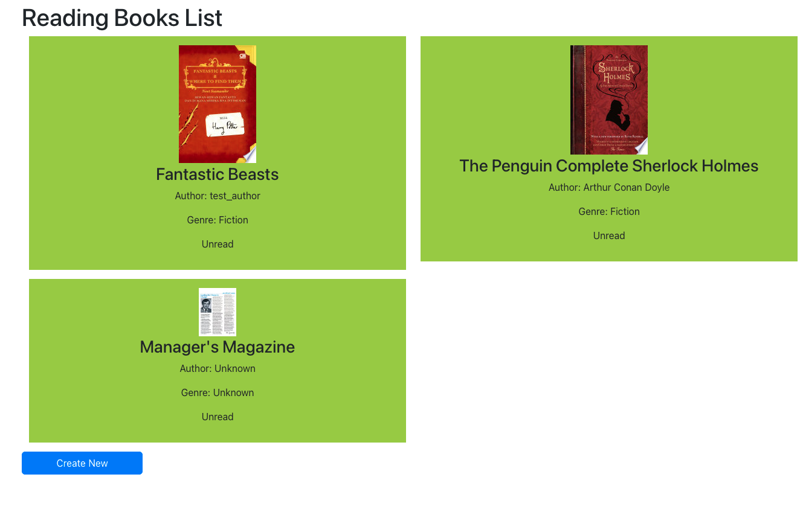

# Reading List App

This is an app to save books for reading list, also supports the use of third party APIs (Google Books).

## How to run

1. Start the backend: `(cd books_project && python3 manage.py runserver)`
2. Start the frontend: `(cd frontend && npm run start)`
3. Navigate to `http://localhost:3000`

## Libraries used and why
1. Django (backend, used for quickly create REST API)
2. React (frontend, used for quickly creating the frontend)

## Screenshots and GIF used
Homepage:

## What would you do if you had more time
Most of the time was spent learning Django and React, so some of the tasks are not complete yet.
It has been a while since using React (1 year ago) and back then I wasn't using React in-depth, so I wasn't able to complete most of the frontend stuffs right now on time.

1. Edit functionality for the saved book in frontend and backend
2. Book delete functionality in frontend
3. Book search integration
4. Google Books API integration
5. Mark book as read & unread
6. Separation of dev & prod env.
7. Docker support for better separation of components for easier development purpose in teams
8. Automated tests for better reliability
9. More docs